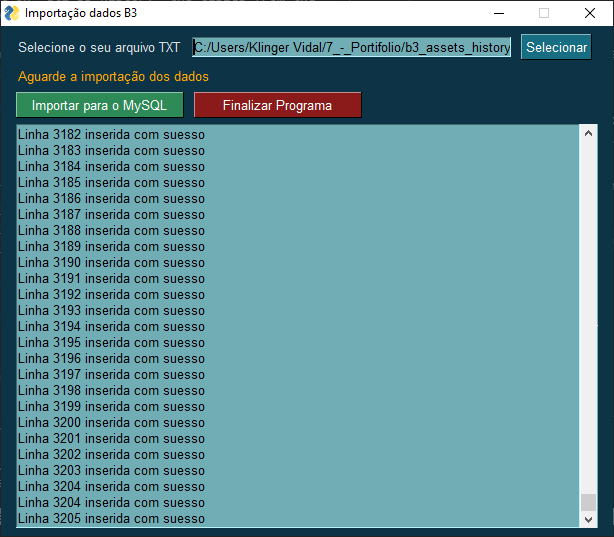
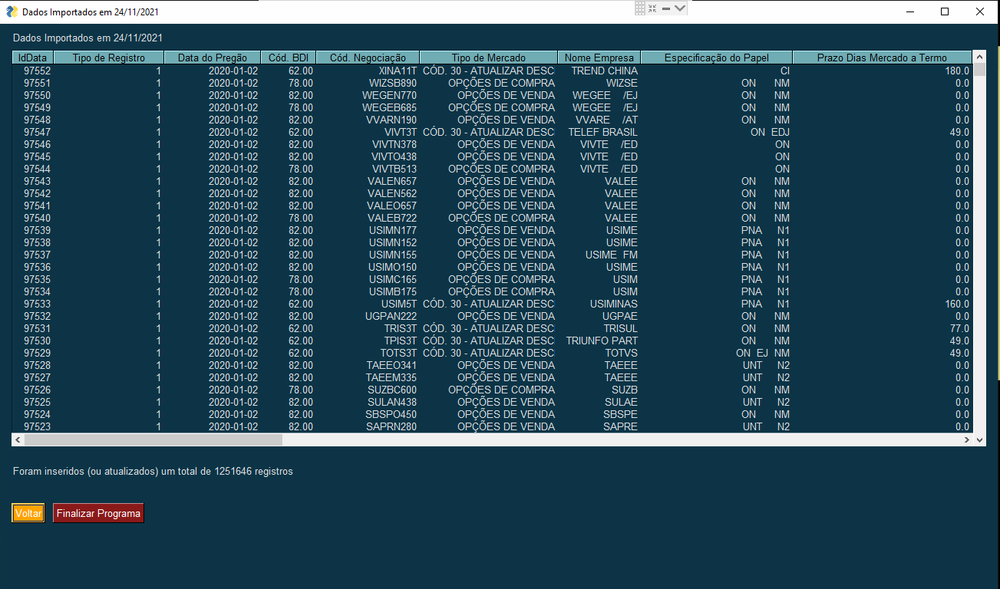

# b3_assets_history

## This application provides a simple way to load and transform data about assets from B3 website. You can see bellow, some instructios about how to use that.  

# INSTRUCTIOS

## REQUIREMENTS

- It's necessary MySQL database running on you local host (desktop);

- MySQL database version 5.7 or higher;

## STEPS TO CONFIGURE

- Install MySQL in your local host (you can use wamp or xamp if you want);

- Create the database "etl_b3_history";

- Import on "etl_b3_history" the tables from the file "MODEL_DB_etl_b3_history.sql";

## STEPS TO USE THE APP

- 1. Make sure if your MySQL is turned on. Case not, turn it on;

- 2. Access B3's website to get the assets data (<a href="https://www.b3.com.br/pt_br/market-data-e-indices/servicos-de-dados/market-data/historico/mercado-a-vista/series-historicas/" target="_blank">click here</a>);
- 3. Run the executable file "gui.exe";
- 4. Select the file that you just download in the B3's website;
- 5. Click at "Importar para o MySQL";

- 6. Wait until the finish of the process, so, you will can see and check the upload data to the database;

###  Note: It was developed just to practice and study the Python Language. The code write and all comments are in English language, just to practice the English lenguage and also because it's considered a good practice in the develop community, whenever appropriate, implement the codes in English language.  
> ## Thankyou for visiting.

  

## Esta aplicação proporciona um jeito simples para relizar upload e tratar dados de ativos do site da B3.

# INSTRUÇÕES

## PRÉ REQUISITOS

- É necessário que o MySQL esteja rodando em seu local host (sua máquina local);
- Versão do banco de dados MySQL 5.7 ou superior;

## PASSOS PARA CONFIGURAR

- Instale o MySQL na sua máquina local (você pode utilizar o wamp ou xamp se quiser);
- Crie a base "etl_b3_history";
- Importe na base "etl_b3_history" as tabelas do arquivo "MODEL_DB_etl_b3_history.sql";

## PASSOS PARA UTILIZAR A APLICAÇÃO

- 1. Certifique-se se seu MySQL está ligado. Caso não esteja, ligue-o;
- 2. Acesse o site da B3 para obter os dados dos ativos (<a href="https://www.b3.com.br/pt_br/market-data-e-indices/servicos-de-dados/market-data/historico/mercado-a-vista/series-historicas/" target="_blank">clique aqui</a>);
- 3. Run the executable file "gui.exe";
- 4. Selecione o arquivo que você acabou de baixar no site da B3;
- 5. Clique em "Importar para o MySQL";

- 6. Espere até o processo ser encerrado, então, você poderá ver e checar os dados gravados no banco de dados;

###  Observação: Esta aplicação foi desenvolvida apenas para praticar e estudar a Linguagem Python. A escrita do código e todos os comentários estão em inglês apenas para praticar o idioma inglês e porque também é considerado uma boa prática na comunidade de desenvolvedores, sempre que apropriado, implementar os códigos em inglês.    

> ## Obrigado pela visita.
